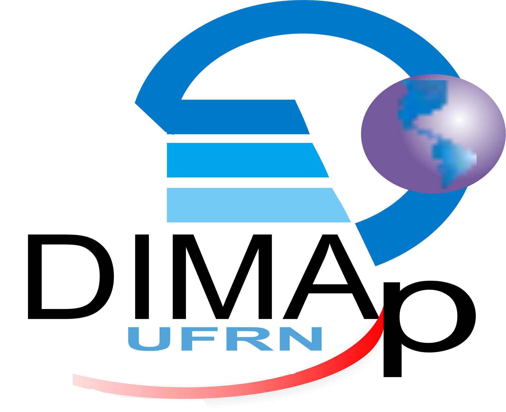
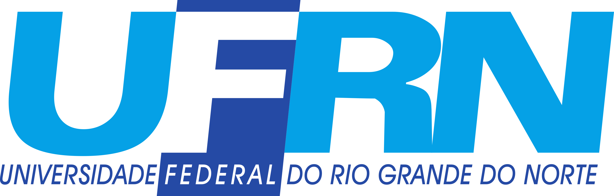

<div aligh=center style="padding-bottom: 80px;">



</div>

</br>
</br>

<div align=center>

# Grafos

</div>

# Trabalhos de Grafos

## UI - Projeto unidade 1

## UII - Projeto unidade 2

### Infraestrutura de Fibra Óptica Intermunicipal (Otimização com Grafos)

Este projeto resolve um problema prático de engenharia de telecomunicações: interconectar 20 pontos estratégicos de uma região metropolitana com uma nova rede backbone de fibra óptica subterrânea. O objetivo principal da engenharia é interconectar todos os 20 pontos com o menor custo total de cabeamento possível, minimizando as distâncias de escavação e garantindo a conectividade total sem redundâncias cíclicas (Árvore Geradora Mínima - MST).

O sistema modela a malha urbana como grafos e implementa quatro algoritmos clássicos para fins de comparação de performance e adequação técnica, orquestrados por uma interface interativa em Python.

#### Tecnologias Utilizadas

* **C++:** Lógica pesada e estruturas de dados (Kruskal, Boruvka, Chu-Liu/Edmonds e Prim).
* **Zig:** Implementação de alta performance para o algoritmo de Prim (não utilizada nos testes).
* **Python:** Interface de linha de comando (CLI) interativa utilizando a biblioteca `InquirerPy`.

#### Algoritmos Implementados

O projeto aborda tanto cenários com conexões bidirecionais quanto cenários com restrições de fluxo (unidirecionais):

* **Algoritmo de Prim** (Grafos Não-Direcionados) - *Implementado em Zig (testes realizados com a versão em C++)*
* **Algoritmo de Kruskal** (Grafos Não-Direcionados) - *Implementado em C++*
* **Algoritmo de Boruvka** (Grafos Não-Direcionados) - *Implementado em C++*
* **Algoritmo de Chu-Liu/Edmonds** (Grafos Direcionados) - *Implementado em C++* (Caso de uso não trivial com variação que restrinja o fluxo a enlaces unidirecionais).

#### Estrutura do Projeto

* `menu.py`: Orquestrador em Python que gera o menu interativo e gerencia os subprocessos.
* `prim.zig`: Código-fonte do algoritmo de Prim.
* `kruskal.cpp`, `boruvka.cpp`, `chuliu_edmonds.cpp`: Códigos-fonte dos respectivos algoritmos.
* `adjacency_matrix.h` e `incidence_matrix.h`: Classes base para leitura dinâmica de arquivos `.txt` e estruturação dos grafos na memória.
* `grafo.txt`: Base de dados padrão com a matriz de conexões não-direcionadas (Dataset 1).
* `grafo_chuliu.txt`: Base de dados modificada contendo um caso de uso não-trivial com enlaces unidirecionais para o algoritmo de Edmonds.

---

##### Como Executar o Projeto

Para rodar o projeto basta navegar para o diretório `graphs/UII/` e rodar o `setup.sh`, em seguida é só rodar o `menu.py`.

``` bash
cd UII/
chmod u+x setup.sh
python menu.py
```
